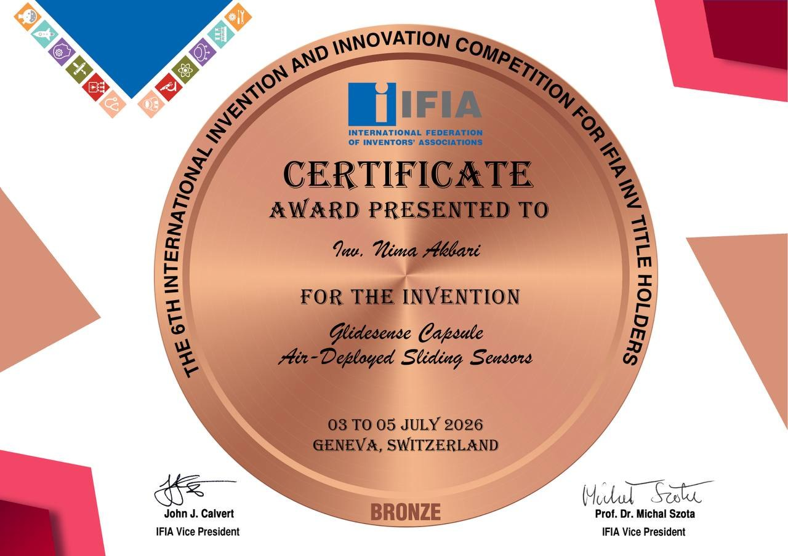
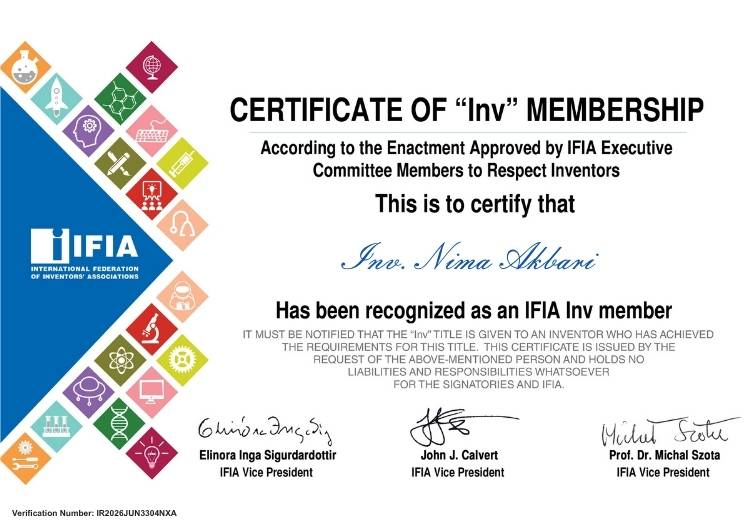

# Hi, I'm Nima 👋

💻 AI & Python Developer  
🤖 Interested in Artificial Intelligence, Computer Vision & Software Development  
🚀 Building projects and learning something new every day

---

## 🚀 Featured Project

### 🎓 Classroom Focus Detector

An AI-powered classroom monitoring project designed to analyze student attention using computer vision.

🔗 [View Project](https://github.com/NIMAAKBARI89/Classroom-Focus-Detector)

---

## 🏆 Achievements

### 🥉 Bronze Award — IFIA

**6th International Invention and Innovation Competition**  
📍 Geneva, Switzerland  
📅 July 3–5, 2026

Awarded for the invention:

**Glidesense Capsule — Air-Deployed Sliding Sensors**

---

### 🏅 IFIA Inv Member

Recognized as an **IFIA Inv Member** by the International Federation of Inventors' Associations (IFIA).

 ### 🥈silver award - INNOVERSE
 
 I’m proud to share that my team and I achieved 2nd place in the INNOVERSE competition with our project, Classroom Focus Detector. 🥈🏆

This project was developed to use AI to analyze students’ focus and engagement in the classroom and provide meaningful insights.

I’m incredibly grateful to my teammates and everyone who supported us throughout this journey. This achievement motivates us to keep learning, innovating, and building better solutions. 🚀
---

## 💻 Skills

- Python
- OpenCV
- Artificial Intelligence
- Computer Vision
- Git & GitHub

---

## 📊 What I'm Working On

- 🤖 Artificial Intelligence
- 👁️ Computer Vision
- 🐍 Python Projects
- 🚀 Innovative Projects

---

## 📫 Contact

Feel free to connect with me through GitHub.
